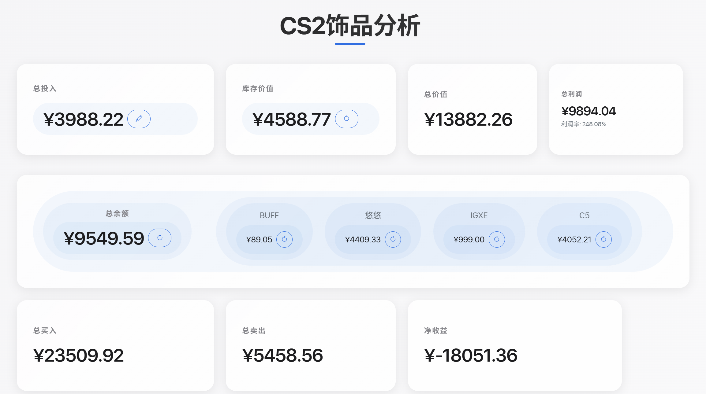
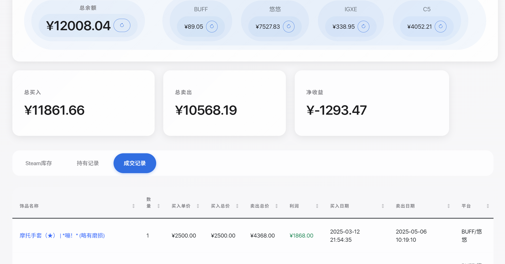

# CS2Profit - CS2交易分析系统

一个用于分析CS2游戏物品交易数据的本地系统，支持多个交易平台的数据分析和可视化展示。




## 功能特点

### 数据统计
- 总投入金额统计
- 库存价值实时计算
- 总价值（库存+余额）统计
- 总利润和利润率计算
- 支持手动编辑总投入金额

### 账户余额
- 多平台余额显示（BUFF、悠悠、IGXE、C5）
- 总余额自动计算
- 支持单独刷新各平台余额
- 支持一键刷新总余额

### 交易统计
- BUFF平台交易数据统计
  - 总买入金额
  - 总卖出金额
  - 净收益计算

### 交易记录
1. 持有记录
   - 显示当前持有的所有饰品
   - 包含饰品名称、数量、单价、总价、买入日期和平台信息
   - 支持点击饰品名称跳转到对应平台页面
   - 支持按各列进行排序

2. 成交记录
   - 显示已完成交易的饰品
   - 包含买入和卖出的完整信息
   - 显示每笔交易的利润（红色表示亏损，绿色表示盈利）
   - 支持批量物品（如印花、武器箱）的数量统计
   - 支持按各列进行排序

## 数据来源

系统支持这些交易平台的数据： BUFF、悠悠有品、IGXE、C5

## 安装说明

1. 环境要求：
   - Python 3.8或更高版本
   - 现代浏览器（Chrome、Firefox、Edge等）

2. 安装步骤：
   ```bash
   # 克隆项目
   git clone https://github.com/yourusername/CS2Profit.git
   cd CS2Profit

   # 安装依赖
   pip install -r requirements.txt
   ```

## 使用说明

### 1. 配置Cookie和APPKey

系统需要各平台的Cookie信息才能获取数据。以下是获取Cookie的步骤：

#### BUFF、悠悠、IGXE平台
1. 运行Cookie获取脚本：
   ```bash
   # BUFF平台
   python data/cookie/save_buff_cookies.py
   
   # 悠悠有品平台
   python data/cookie/save_youpin_cookies.py
   
   # IGXE平台
   python data/cookie/save_igxe_cookies.py
   ```
2. 脚本会自动打开浏览器，请在浏览器中登录对应平台
3. 登录成功后，按回车键继续
4. 脚本会自动保存Cookie到对应的`cookie.json`文件

#### C5
通过API获取余额：https://www.c5game.com/user/user/open-api
在API管理中开通API功能，复制app_key，放到data\cookie\c5_api_key.json中即可

### 2. 导入交易记录

#### BUFF平台交易记录导入
1. 登录BUFF网站(https://buff.163.com)
2. 访问"我的出售-出售记录"页面(https://buff.163.com/market/sell_order/history?game=csgo&state=success)
3. 筛选条件：选择"交易成功"状态
4. 点击"导出记录"按钮下载CSV文件
5. 将下载的两个CSV文件放入`data/buff/`目录中

### 3. 启动应用
```bash
python app.py
```

### 4. 访问系统
- 打开浏览器访问：`http://127.0.0.1:5000`
- 系统会自动加载最新数据

### 5. 数据更新
- 点击各平台的刷新按钮更新对应余额
- 点击总余额刷新按钮更新所有平台余额
- 点击编辑按钮修改总投入金额

### 6. 数据查看
- 切换"持有记录"和"成交记录"标签页查看不同类型的数据
- 点击表格表头可以按照对应列进行排序
- 点击饰品名称可以跳转到对应平台的详情页

## 技术栈

- 后端：
  - Python
  - Flask：Web框架
  - Pandas：数据处理

- 前端：
  - Bootstrap 5：UI框架
  - JavaScript：交互逻辑
  - 原生CSS：自定义样式

## ⚠️ 注意事项

> ***重要提醒：***
> 
> - **本系统仅用于本地数据分析，不会上传任何数据**
> - **不会获取你的私人数据盗你号，懂代码的看看代码就行了，纯离线自用**


## Todo

1. 悠悠有品、C5和IGXE交易记录获取和放入（BUFF可以导出记录，赞，剩下几个平台没发现可以导出，难受）
2. 美化

## 贡献指南

欢迎提交Issue和Pull Request来帮助改进项目。在提交代码前，请确保：
1. 代码符合项目的代码风格
2. 添加了必要的注释和文档
3. 测试过代码的功能 